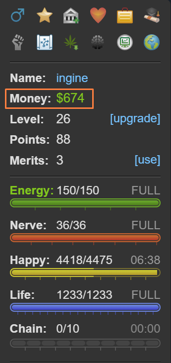

# Torn City

Torn offers a unique gaming experience that stands out from the rest. Unlike fleeting thrills, Torn is a commitment to long-term engagement without a predefined endpoint. It thrives on the satisfaction of delayed rewards, distinguishing itself and offering a uniquely fulfilling journey.

In the realm of gaming, Torn serves as a sanctuary—a completely free-to-play haven untainted by pay-to-win tactics. You won't encounter coercive in-app purchases that demand your money for quick power-ups. Under the careful stewardship of Chedburn, the game remains steadfast against exploiting its players, ensuring a fair environment where real money is optional and intrusive ads are practically non-existent.

Like any vibrant community, Torn hosts a mix of supportive individuals and more dubious characters. Navigating potential pitfalls is straightforward with vigilance, especially given that the game permits scamming.

The community, vast and generally supportive, rewards respect and engagement. Torn's intricacies defy comprehensive guides, yet essential advice is invaluable for both newcomers and returning veterans alike.

Often labeled a "criminal game," Torn allows players to partake in attacks and illicit activities, although beginners start at a disadvantage compared to seasoned players. Starting quietly, honing combat skills, building alliances within your faction, and savoring the journey are prudent steps. While the allure of criminal pursuits is undeniable, progressing steadily and cautiously fortifies your standing in the game.

## Essentials
Let's delve into the fundamentals. In Torn, players are presented with a multitude of gameplay options, each requiring a solid grasp of the game's core mechanics. Below, we outline some essential basics to ensure you're well-equipped to navigate this diverse gaming experience.

### Networth
A player's net worth (referred to as `NW` by many) is essentially a reflection of their total assets, including cash, items, and the value of properties or stocks in the bazaar. It holds significant importance in Torn as it determines your ability to engage in various activities, such as purchasing assets, placing bounties, or even engaging in happy jumping from the outset. While certain items like merits and mission points require effort to acquire, having sufficient cash or belonging to a capable faction—such as ours 😉—can expedite your access to these opportunities.

#### Money

The highlighted section in the sidebar above represents your immediate cash on hand in Torn. It's important not to accumulate too much, as this is the money vulnerable to theft. According to the official Torn wiki,
> The base percentage you are able to steal from a player is 5%. This value is then modified with a multi-dice-roll RNG up to 10%, however lower percentages closer to 5% are favoured and values close to 10% would be extremely rare.

Therefore, having a large amount of cash makes you a target for theft if you're frequently found with it.

???+ tip "Mugging is common"
    Mugging is a common occurrence in Torn and a significant means of in-game earning. If you find yourself frequently targeted, don't be discouraged. Instead, consider using secure options like the bank, stocks, your property's vault, or the faction vault to safeguard larger sums of money.

### Battle Stats
Battle stats are crucial in Torn for activities like mugging, defeating opponents, and asserting dominance. They significantly influence your effectiveness in faction wars, where you might find yourself a target rather than the aggressor.

There are four stats: Strength, Speed, Defense, and Dexterity. Each stat offers distinct advantages, so focusing on one or two at the expense of others is initially discouraged. Building up all stats to 250,000 each should be your primary goal early on. This balanced approach ensures you are well-rounded and capable in various situations. Once you achieve this milestone, you can explore more specialized strategies and delve into advanced guides to further refine your gameplay.

The table below provides a basic overview of what each stat is used for:

| Stat      | Description                                                                                         |
|-----------|-----------------------------------------------------------------------------------------------------|
| Strength  | Increases the damage you deal each hit.                                                             |
| Defense   | Reduces the damage you take per hit.                                                                |
| Speed     | - Increases the chance of hitting your opponent.                                                    |
|           | - Decreases your opponent's chance of escaping from you.                                            |
| Dexterity | - Increases your chance of dodging an attack.                                                       |
|           | - Increases your chance of stealthing an attack.                                                    |
|           | - Decreases your opponent's chance of stealthing an attack.                                         |
|           | - Increases your chance of escaping from an opponent.                                               |

There are several ways to boost your battle stats in Torn, with the primary methods being energy training and using army job points to target specific attributes. For detailed strategies and specifics on each method, refer to the Torn Wiki [here](https://wiki.torn.com/wiki/Battle_Stats){:target="\_blank"}.

### Level
In Torn, the level progression strategy can significantly impact gameplay. Here's a breakdown to help you navigate:

| Level | Strategy |
|-------|----------|
| 15    | Unlock the travel action, essential for accessing game features. |
| 20    | Consider leveling up to this point to avoid being an easy target. At level 15, being the lowest level that can fly makes you conspicuous to other players. |
| 20+   | Increasing beyond level 20 may attract players looking to gain experience by attacking higher-level opponents. |

The key is to balance leveling with your battle stats to ensure you're not an easy catch for other players. Aim for level 20 initially and then assess based on your confidence in your stats. More details on level can be found [here](https://wiki.torn.com/wiki/Level_and_Ranks){:target="\_blank"}.

### Energy
Energy is represented by the green bar located on the sidebar. Players without donator packs or subscriber status have a maximum of 100 energy, which replenishes at a rate of 5 energy every 15 minutes. Those with the donator status from purchasing a donator pack (available for in-game currency or real money) or who are subscribers (requiring a real money investment) enjoy a higher maximum energy of 150, refilling 5 energy every 10 minutes.

While the typical maximum energy is either 100 or 150, players can exceed this limit, stacking energy up to a total of 1000 using items such as drugs (like Xanax and LSD, contributes for drug cooldown) or boosters such as the Feathery Hotel Coupon (often abbreviated as FHC) and Energy Drinks(contributes towards booster cooldowns).

Energy serves multiple purposes, primarily enabling activities such as gym training, attacking other players, and scavenging for items in the city dump. Each of these actions consumes varying amounts of energy.

???+ Example "Energy Stacking"
    Energy stacking is a straightforward concept. 
    
    For example: To stack your energy up to 1000, you first deplete all your energy (bringing it down to 0). Then, you begin taking Xanax and ensure you refrain from spending energy on the actions mentioned earlier.
    
    This practice is typically employed to prepare for happy jumps and to be fully prepared for war.

    :simple-renault: The stacked energy does not reset unlike stacked happy.

### Nerve
The "Nerve" is indicated by the red bar in the sidebar. It allows you to commit various crimes and aid in jailbreaks. Initially, your nerve is capped at 30, but you can increase it through merits, company specials, and faction specials. However, bonuses do not reflect your actual crime experience, known as Natural Nerve Bar (NNB). NNB is crucial for achieving higher success rates in crimes, participating in faction organized crimes, and increasing your success rate in jailbreaks.

It replenishes at a rate of 1 point every 5 minutes, which cannot be altered unlike energy.

???+ Info "Organised Crimes"
    Nerve is specifically reserved for active actions, meaning it is used when actively committing crimes. Joining or initiating organized crimes within factions, tasks typically handled by higher ranks, does not deplete your nerve bar. 

### Happy
Happy, represented by the yellow bar in the sidebar, may seem out of place in Torn's crime-filled city at first glance. Even the game's owner appears uncertain about its precise role, stating:
!!! Quote "[Torn Wiki](https://wiki.torn.com/wiki/Happy#:~:text=Happy%20or%20happiness%20plays%20a%20role%20in%20all%20aspects%20of%20the%20game%2C%20although%20the%20precise%20extent%20of%20its%20influence%20in%20most%20areas%20remains%20uncertain.){:target="\_blank"}"
    Happy or happiness plays a role in all aspects of the game, although the precise extent of its influence in most areas remains uncertain.

One area where happiness undeniably impacts gameplay is in gym gains, particularly noticeable when your stats are low until they reach 250k each. Beyond this point, its effects become less discernible.

The maximum permanent base happy any player can achieve is 5025. If your happiness level is only in the hundreds, it's likely because of the property you live in. Increasing happiness is straightforward: own a good property and reside there, or utilize Torn's rental feature to settle in a luxurious residence. It regenerates 5 points every 15 minutes.

Like other bars in Torn, happiness limits can be exceeded. This exceeded happiness is referred to as temporary happiness, which can be increased using items such as boosters and drugs. The maximum achievable level is 99k, and reaching this milestone for the first time earns you a special award.

???+ Warning "Happy stacking reset"
    Unlike energy, which can stack indefinitely until used, happy resets regularly every fifteen minutes at XX:00, XX:15, XX:30, and XX:45. Stacking happy is primarily done for happy jumps, so it's crucial to be mindful of the timing when performing one.

???+ Tip "Overdose & Happy regen"
    If you have a lot of happy and have overdosed on drugs, which is a common occurrence, it takes a significant amount of time to regenerate. Instead of waiting or using up boosters to regain happiness, a more efficient approach is to travel to Switzerland and undergo rehabilitation. The benefit is that you don't need to completely eliminate your addiction; the first $250k spent on rehabilitation will completely refill your happy to full.