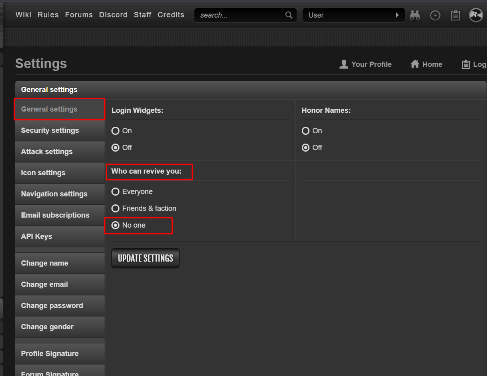

# Torn Faction War Guide
_“Efficient, strategic, and brutal. That’s how we win.”_
## Introduction
War in Torn can be a thrill: fun, brutal, exhausting, and sometimes expensive. This guide covers the **essentials of faction wars**: what you must always do, the different types of wars, how to turtle, and how to **score better** so your hits actually help the team.

Whether you're a seasoned fighter or new to the chaos, follow these basics to ensure you're pulling your weight and not leaking points.

---
## The Must-Dos in Every War

No matter the type of war, you **must**:

### 1. **Stack Your Energy**
- Always have **900 to 1000 energy** ready before war starts.
- This ensures you're prepared to attack when needed, and the faction can rely on you.

### 2. **Turn Off Your Revives**
- Do **not** let the enemy revive and re-farm you.
- Go to your settings and **disable revives** before war begins.

---
## Types of Wars

### 1. **Termed Wars**
- These are pre-arranged or negotiated fights with another faction.
- Usually, it's decided in advance who wins or loses, but we aim to **maximize rewards** regardless.

**Termed War Etiquette:**

- Avoid hitting onliners. If your target is offline, use the "Leave" option instead of hospitalizing them. Idlers (15+ minutes inactive) are usually okay to hit.
- Talk to the opposing faction if you or they can **med out** to speed up scoring.

!!! Note "Etiquette is not always followed" 
    While there are agreed-upon rules during termed wars, not everyone follows them.
    Some players may be unaware, may not care, or accidents might happen (like being mistaken as idle or offline).

    If this happens, send them a direct message. If they don't respond, notify the leadership team and they'll handle it from there.
---
### 2. **Un-termed (Real) Wars**
- These are full-blown wars with no agreements.
- Everything is fair game, and winning **depends entirely on us**: strategy, activity, and teamwork.

---

## Turtling: How to Avoid Bleeding Points

If you **can’t be online** during the war, or are underpowered compared to the opponent, your top priority is to **avoid getting farmed**.

### What Is Turtling?

Turtling means **making yourself unavailable for attacks**, usually by hospitalizing yourself or traveling. If you’re giving away more points than you’re scoring, you’re actively hurting the team. **Your first priority is to avoid being an easy target.** Don’t be that guy.

|Method|Hospital Time|Efficiency|Requirement|Medical Cooldown|Cost|
|---|---|---|---|---|---|
|**Blood Bags**|120 mins|Great|Intravenous Therapy course|30 mins|Free from faction armory|
|**Ipecac Syrup**|60–90 mins|Good alternative without the course|None|30 mins|Free from faction armory|
|**Small Explosive Device**|5 hours|Best if you're going to sleep|None|None|~6.2m (as of 07/08/25)|

---

### Other Options
- **Bountying or Mercing**: While technically an option, we **do not** recommend or support this, and should be avoided entirely. After a player leaves the hospital, there is a **60-second protection window** during which outside attackers (like bounty hunters or mercs) **cannot** hit them. However, the **enemy faction can** still attack you during this time, which means they will almost always get to you first. It’s expensive, unreliable, and wastes faction resources. **Stick to self-hospitalizing or traveling.**
    
- **Traveling**: A solid option if you're busy with real life and can't participate actively in war. Just remember that you **won’t be able to score**, and you’re **vulnerable to being camped while abroad**. No one can help you until you return, so travel smart.
    

Avoid having too many members flying to the same short-distance location at once. While some overlap is unavoidable, try to **spread out** travel destinations to reduce the risk of being picked off.

Choose your travel destination based on how long you’ll be inactive:

| **Flight Duration** | **Destinations**                   | **When to Use**                                                          |
| ------------------- | ---------------------------------- | ------------------------------------------------------------------------ |
| **Short flights**   | Mexico, Cayman Islands, Canada     | Ideal if you just need a quick break or want to reset your cooldowns.    |
| **Medium flights**  | Hawaii, UK, Argentina, Switzerland | Gives more breathing room. Good if you'll be back within a few hours.    |
| **Long flights**    | Japan, China, UAE, South Africa    | Best if you’ll be offline for an extended period. Keeps you safe longer. |

---

## War Strategy Checklist

- [x] **Stack 900 to 1000 energy** beforehand.  
- [x] **Use Vicodin** if you're attacking. It boosts stats by 25% and has a 4 to 6-hour cooldown.  
- [x] Be available at **war start** if possible.  
- [x] If unavailable, **turtle** or **travel** smart.  
- [x] **Coordinate** in faction chat before attacking.  
- [x] **Score efficiently**, not just frequently.  
- [x] **Leave offliners whenever possible.** Leaving offline players yields the best respect and shortens their hospital time, which gives us more chances to score on them again.  
- [x] **Hospitalize active scorers.** If someone is online and actively hitting us, hospitalizing them forces them to use med cooldowns, slows down their scoring, or discourages them from continuing.  
- [x] **Monitor your medical cooldown.** If you’re scoring consistently in a real war, you’re likely being hospitalized too. Med cooldowns run out fast, and once they’re gone, you’ll be stuck waiting to heal — which means less time scoring and a lower contribution overall.

    

---

## Scoring: How to Earn More Respect

A common issue: high-stat players logging in briefly, farming weak targets, leaking points, and logging off. We appreciate your effort, but **efficiency matters more than raw activity**.

We reward players with **high average scores** during wars. Here’s how to make every hit count:

### Key Tips for High Respect:

- **Target higher-level players**. The higher the level, the better your base respect.
    
- **Join chains early**. Respect increases the deeper into the chain you are.
    
- **Use group attacks**. Hitting with teammates gives bonus respect.
    
- **Retaliate smartly**. To earn the retaliation bonus, you must hospitalize someone who attacked us within the last 5 minutes. This should only be done during un-termed (real) wars, or when given the green light by leadership.
    
- **Leave or hospitalize wisely**:  
    → **Leave** if the target is offline.  
    → **Hospitalize** if they’re online to prevent them from hitting back.
    
- **Always hit war targets**, unless none are available and the chain needs saving.
    
- **Go for fair fights**. Hitting targets near your stat range gives up to **3× respect**. Avoid extremely weak targets.
    

In short: **attack efficiently, not lazily**. Think before you hit. Every point matters—both what you gain and what you give away.

