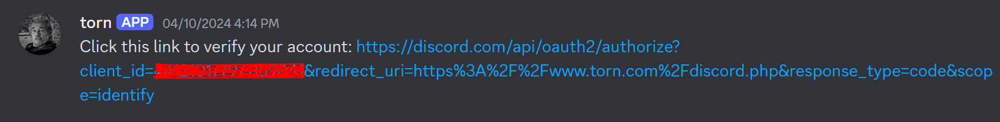
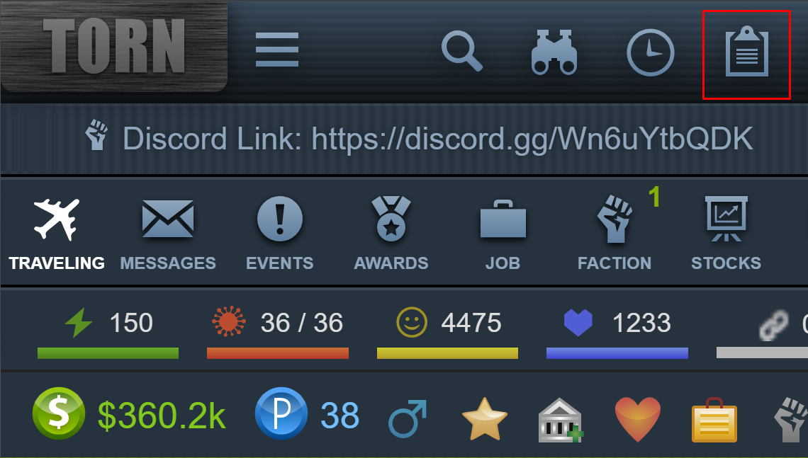
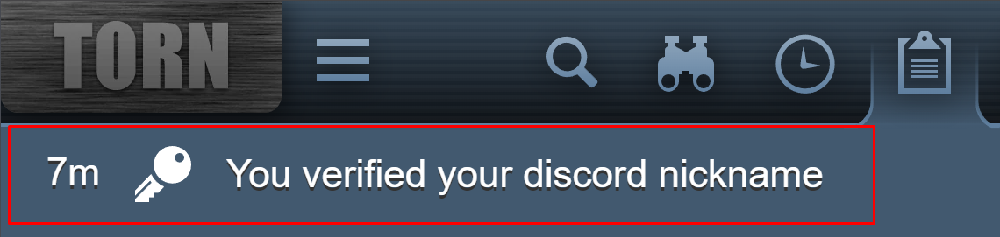
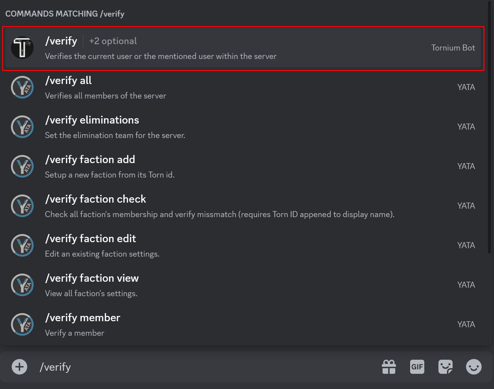
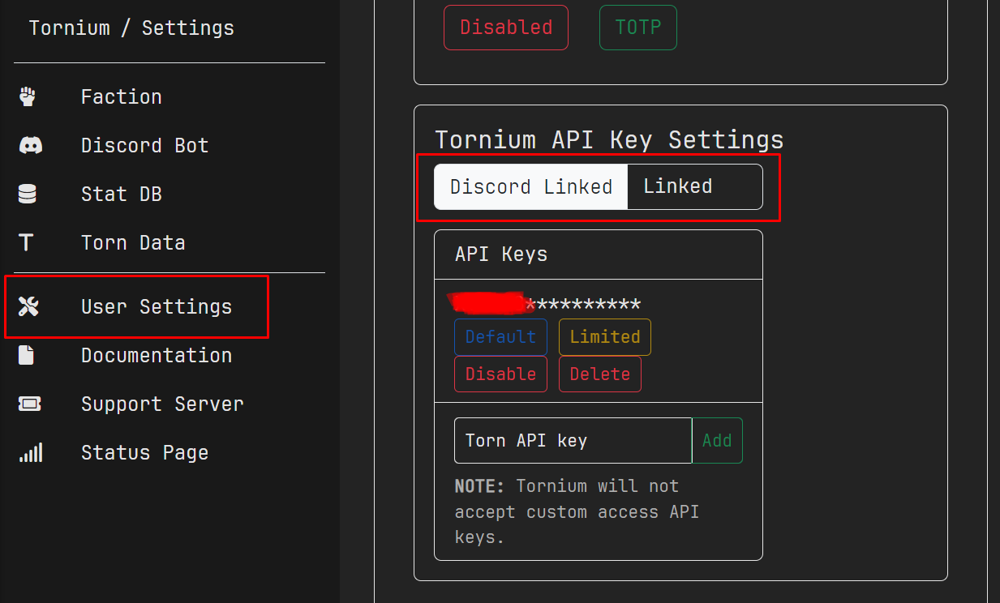

Discord serves as our primary platform for operations. It's where we engage in teaching and learning, maintain constant communication, stay active, and most importantly, handle faction banking.

Simply joining the server, however, isn't sufficient because we rely on Discord bots to automate tasks. We're here to guide you through setting up and using these tools effectively. Follow the steps below to get started.

## Join Discord Servers
1. Join Samurai Uprising's Discord server using this link: [Samurai Uprising's Discord](https://discord.gg/3Y2PBSBnJk){:target="\_blank"}.

- Join Torn's Official Discord server using this link: [Torn's Official Discord](https://discord.gg/TVstvww){:target="\_blank"}.

## Torn Discord Verification
1. If you're joining Torn's server for the first time, you should see the torn bot welcome you to the server via direct message(DM).
 
 

    

- In the DM conversation with the torn bot, type `!verify` and send it. You should get something like this:
 
 

## Complete Verification
1. Follow the link sent by the bot in the DM.
- You'll be taken to a page with a button that will verify your Torn nickname, click it.
 
 

- Check your Torn logs to confirm successful verification.
 
 

## Connect with Tornium
1. Log in to [Tornium](https://tornium.com/) using one of your `Limited Access` API keys.

## Finalize Verification on Samurai Uprising's Discord
1. Return to the Samurai Uprising's Discord server
- Type `/verify` and hit enter in this channel. (Make sure it's the Tornium bot and not others)
 
 

## Confirm Discord Linking on Tornium
1. Visit User Settings on Tornium.
- Ensure the **Discord Linked** field displays `Linked`
 
 
