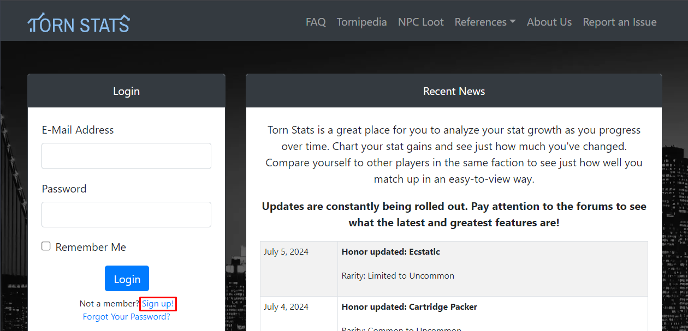
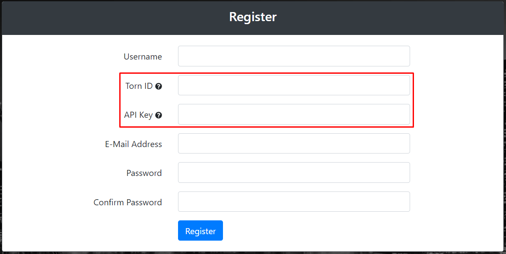
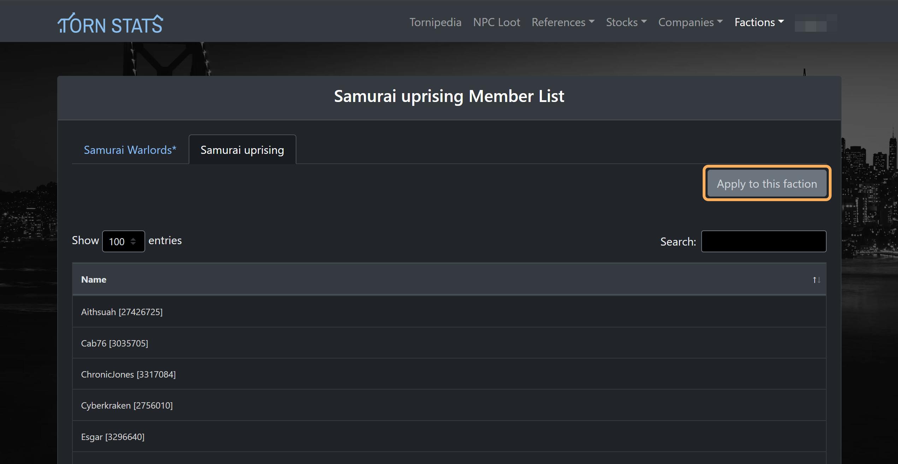

[TornStats](https://tornstats.com/){:target="\_blank"}  is an essential tool offering detailed statistics and insights into your Torn gameplay. As a faction member, you'll share details such as battle stats natural nerve bar etc. If you haven't signed up already follow these steps to set it up:

## 1. Sign up
Go to the [Torn Stats](https://tornstats.com/){:target="\_blank"} website and click on the "Sign up!" link
 
 

!!! Note "Torn Stats operates independently" 
    When you create an account on Tornstats, ==it operates independently== from Torn itself.
    
    Tornstats focuses solely on using your Torn API key and Torn ID.
    
    It doesn't interact with your actual Torn game account beyond needing these two pieces of information. 
    
    In essence, Tornstats is a separate service that uses data from Torn, but it doesn't affect your Torn gameplay or account directly.

## 2. Fill Out Registration Form

Fill out all required fields on the registration form, providing your in-game Torn  ID and a `Limited Access` API key.
 
 

## 3. Apply to faction

Once you've signed up go to [this link](https://tornstats.com/factions/show/5340/apply){:target="\_blank"} and apply for the faction.
 
 

